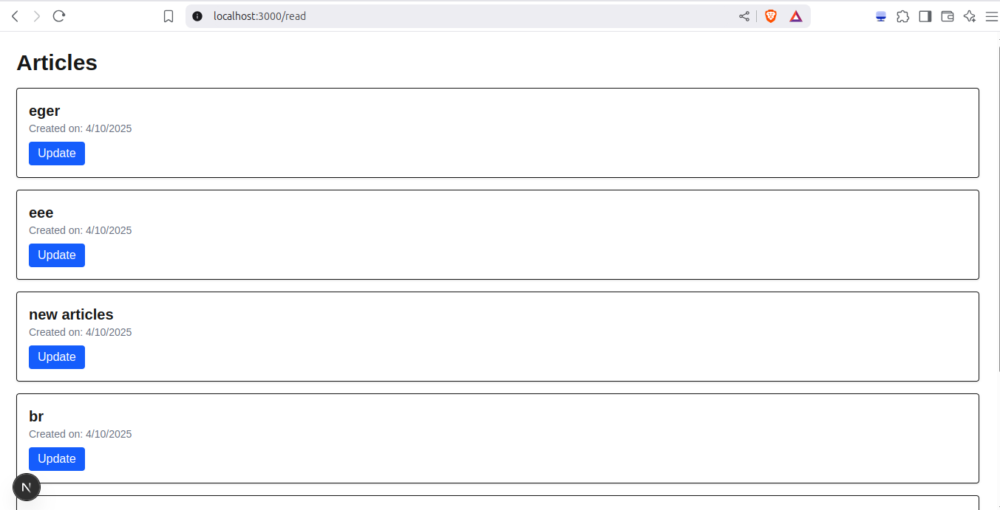
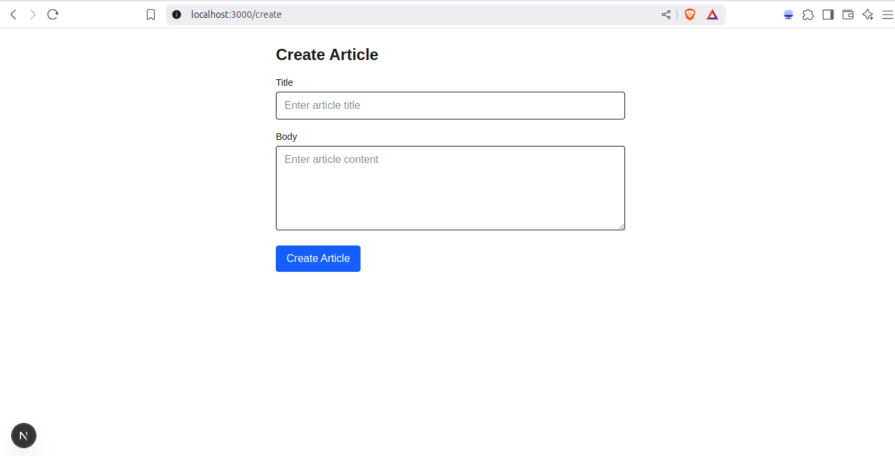
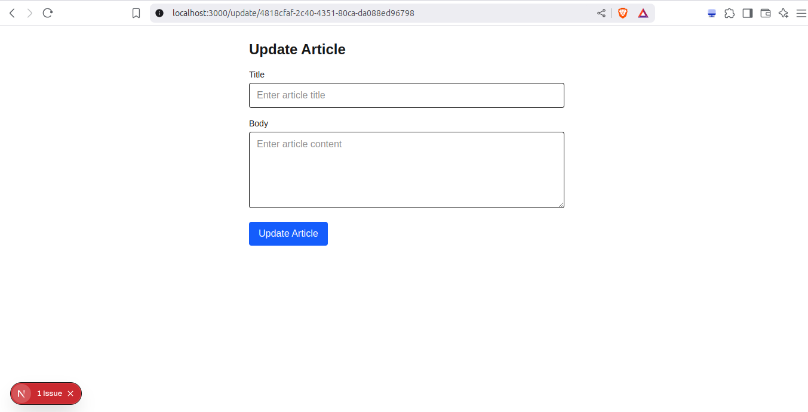

# 🧩 Next-Drupal-app

A decoupled CMS-powered application built with **Next.js** and **Drupal**, demonstrating **CRUD operations**, **pagination**, and **view rendering** using the [`next-drupal`](https://www.npmjs.com/package/next-drupal) library.

This project serves as a practical example of integrating **Next.js App Router** with a **Drupal backend**, fetching and managing dynamic content through the **JSON:API**.

---

## 🚀 Features

- 🔄 Full **CRUD functionality** (Create, Read, Update, Delete) with Drupal resources.
- 📊 Fetching and rendering **Drupal Views** with dynamic pagination.
- 🧱 Clean component structure with **server components** for better performance.
- 🧪 Follows **best practices** for data fetching and rendering in Next.js.

---

## 🧠 Architecture & Setup

### 🗂️ Drupal Client Configuration

We configure two clients with `next-drupal`:

#### 📦 `lib/drupal.ts` (Public routes - for GET requests)

```ts
import { NextDrupal } from "next-drupal"

// Public (browser) client
export const drupal = new NextDrupal(process.env.NEXT_PUBLIC_API_URL)
```

#### 📦 `lib/server-drupal.ts` (Public routes - for other requests)

```ts
import { NextDrupal } from "next-drupal"

export const serverDrupal = new NextDrupal(process.env.NEXT_PUBLIC_API_URL, {
  auth: {
    clientId: process.env.DRUPAL_OAUTH_CLIENT_ID,
    clientSecret: process.env.DRUPAL_CLIENT_SECRET,
  },
})
```

## 🧰 What This App Uses from next-drupal
Here are the main methods used from the next-drupal SDK:

🟢 Reading content:
    drupal.getResource(type, uuid)
    drupal.getView(viewId, { params })
    drupal.getResourceCollection(type, { params })

🔴 Creating content:
    serverDrupal.createResource(type, payload)

🟡 Updating content:
    serverDrupal.updateResource(type, uuid, payload)

⚫ Deleting content:
    serverDrupal.deleteResource(type, uuid)

    Each method supports authentication and relationships as needed, simplifying interaction with Drupal’s JSON:API.

## ✅ Best Practices
    ✅ Use drupal (public client) in server components only to fetch public data.

    ✅ Use serverDrupal (authenticated client) for actions like creating or updating data.

    🚫 Avoid using next-drupal in client components — use it only in Server Components or API routes.

    ✅ Always handle errors gracefully when working with getView, getResource, etc.

    ✅ Use pagination params like page[offset] and page[limit] properly when fetching Views.

## 📸 Results
Here are a few snapshots of what this app renders:





## 💻 Running Locally
1. Clone the Repository
```bash
git clone https://github.com/<your-username>/Next-Drupal-app.git
cd Next-Drupal-app
```

2. Install Dependencies
```bash
npm install
```
3. Create .env.local file
```bash
NEXT_PUBLIC_API_URL=https://your-drupal-site.com/jsonapi
DRUPAL_OAUTH_CLIENT_ID=your-client-id
DRUPAL_CLIENT_SECRET=your-client-secret
```
Ensure OAuth is enabled in your Drupal site and you’ve created a client with the necessary scopes.

4. Run the Development Server
```bash
npm run dev
```
Now visit http://localhost:3000 to see the app in action.

## 🛠️ Technologies Used

1. Next.js 15

2. Drupal JSON:API

3. next-drupal

4. Tailwind CSS

5. TypeScript


